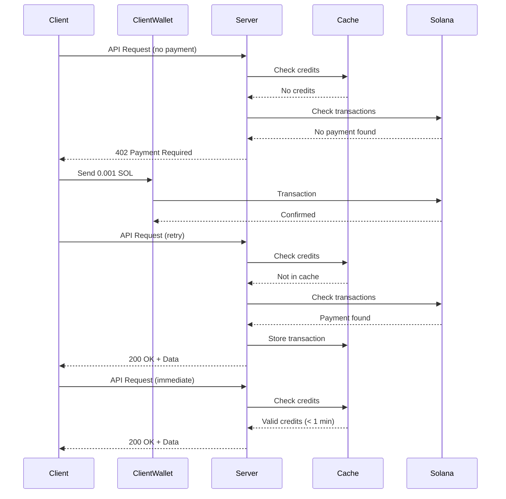

# S402 - Solana Payment Middleware for APIs

S402 is a TypeScript library inspired by [x402](https://docs.x402.org/) that enables API payment verification using Solana blockchain. It provides middleware for Express.js servers and a fetch wrapper for clients, implementing RFC 9421 HTTP message signatures with Ed25519 cryptography.

## Features

- 🔐 **RFC 9421 HTTP Message Signatures** - Cryptographic request signing with Ed25519
- 💰 **Multiple Payment Methods** - SOL, USDC, or Staking for API access
- ⚡ **Automatic Payment Handling** - Client automatically sends payments on 402 responses
- 🗄️ **Server-Side Caching** - Efficient credit tracking to minimize blockchain queries
- 📦 **Modular Architecture** - Core, Express, Fetch, and React packages for flexibility
- 🔄 **Subscription Model** - Time-based access (e.g., 0.001 SOL per 60 seconds)
- ⚛️ **React Integration** - Pre-built components and hooks for wallet integration

## Architecture

```
┌─────────────┐                    ┌─────────────┐
│   Client    │                    │   Server    │
│             │                    │             │
│ @s402/fetch │◄──────402─────────►│@s402/express│
│             │                    │             │
│  Auto-pay   │                    │  Verify &   │
│  on 402     │                    │  Cache      │
└──────┬──────┘                    └──────┬──────┘
       │                                  │
       │         ┌─────────────┐          │
       └────────►│ @s402/core  │◄─────────┘
                 │             │
                 │ • Signing   │
                 │ • Verify    │
                 │ • Solana    │
                 └──────┬──────┘
                        │
                        ▼
                 ┌─────────────┐
                 │   Solana    │
                 │   Devnet    │
                 └─────────────┘
```

## Quick Start

### Installation

```bash
# Install dependencies
pnpm install

# Build (webapp for Cloudflare: produces root dist/)
pnpm build

# Or build all monorepo packages
pnpm run build:all

# Run tests
pnpm test
```

### Deploying the webapp (Cloudflare Pages)

The repo is set up for Cloudflare Pages (or Wrangler direct upload):

- **Commit the lockfile:** `pnpm-lock.yaml` must be committed so Cloudflare uses pnpm (and installs the monorepo workspace). If it was previously ignored, run `pnpm install` then `git add pnpm-lock.yaml` and commit.
- **Build:** From repo root, `pnpm run build` builds `@s402/core`, `@s402/react`, and the webapp, then copies output to `dist/`.
- **Deploy:** `pnpm run deploy` (or `npx wrangler pages deploy dist --project-name=s402-webapp`).

In the Cloudflare dashboard (Pages, Git): set **Build command** to `pnpm run build`, **Build output directory** to `dist`. Cloudflare will detect pnpm from `pnpm-lock.yaml` and run `pnpm install` from the repo root so workspace packages (`@s402/core`, `@s402/react`) resolve correctly.

### Running the Example

The `examples/hello` folder demonstrates a complete client-server integration:

```bash
cd examples/hello

# Terminal 1: Start the server
pnpm server

# Terminal 2: Run the client
pnpm client
```

Or use the automated test script:

```bash
cd examples/hello
./hello.sh
```

## Usage

### Server Setup (Express)

```typescript
import express from 'express';
import { paymentMiddleware } from '@s402/express';
import { createPaymentConfig, PaymentType } from '@s402/core';

const app = express();
app.use(express.json());

// Configure payment: 0.001 SOL per 60 seconds
const paymentConfig = createPaymentConfig(
  'YOUR_SERVER_PUBKEY',  // Where to receive payments
  0.001,                  // subscriptionPrice in SOL
  60,                     // subscriptionTime in seconds
  'solana:EtWTRABZaYq6iMfeYKouRu166VU2xqa1', // devnet
  PaymentType.SOL
);

// Apply middleware to protected endpoints
app.get('/api/data',
  paymentMiddleware({
    payment: paymentConfig,
    publicKey: 'CLIENT_PUBLIC_KEY',  // For signature verification
    requireSignature: true
  }),
  (req, res) => {
    res.json({ message: 'Protected data!' });
  }
);

app.listen(3000);
```

### Client Setup (Fetch Wrapper)

```typescript
import { createS402Fetch } from '@s402/fetch';

// Create fetch wrapper with auto-payment
const s402Fetch = createS402Fetch({
  privateKey: 'YOUR_PRIVATE_KEY_HEX',
  publicKey: 'YOUR_PUBLIC_KEY_BASE58',
  keyId: 'my-key-1',
  signRequests: true,
  autoPayment: true  // Automatically pay on 402 responses
});

// Use like normal fetch
const response = await s402Fetch('http://localhost:3000/api/data');
const data = await response.json();
```

## How It Works

### Payment Flow Diagram



### Payment Flow Steps

1. **First Request (No Payment)**
   - Client sends signed request to protected endpoint
   - Server checks for payment transactions on Solana
   - No payment found → Server returns `402 Payment Required` with payment details

2. **Automatic Payment**
   - Client receives 402 response
   - Automatically sends SOL payment to server's address
   - Waits for transaction confirmation

3. **Retry Request**
   - Client retries original request
   - Server finds payment transaction on blockchain
   - Calculates credits: `(amount / subscriptionPrice) * subscriptionTime`
   - Caches credits for efficient subsequent requests
   - Returns `200 OK` with protected data

4. **Subsequent Requests**
   - Server checks cache first
   - If credits valid → immediate `200 OK` (no blockchain query)
   - If credits expired → checks blockchain for new payments

### Credit Calculation

Credits are time-based:

```
timeCredits = (totalPaid / subscriptionPrice) * subscriptionTime
```

Example:
- Subscription: 0.001 SOL per 60 seconds
- Payment: 0.001 SOL
- Credits: 60 seconds of access

### Caching Strategy

The server maintains an in-memory cache of client credits:

```typescript
{
  clientPublicKey: {
    timeRemaining: 45,  // seconds
    expiresAt: Date,
    lastTransaction: {
      signature: "...",
      amount: 0.001,
      timestamp: Date
    },
    lastChecked: Date
  }
}
```

- Cache hit with valid credits → No blockchain query
- Cache miss or expired → Query blockchain and update cache
- Default cache timeout: 300 seconds

## Packages

### @s402/core

Core functionality for all packages:

- **Key Management**: Ed25519 keypair generation and conversion
- **Signing**: RFC 9421 HTTP message signing
- **Verification**: Signature and payment verification
- **Solana Integration**: Transaction sending, fetching, and verification
- **Caching**: Credit cache management

### @s402/express

Express.js middleware:

```typescript
import { paymentMiddleware } from '@s402/express';

app.use('/protected', paymentMiddleware({
  payment: paymentConfig,
  publicKey: clientPublicKey,
  requireSignature: true
}));
```

Features:
- Signature verification (RFC 9421)
- Payment verification (Solana)
- 402 Payment Required responses
- Automatic credit caching

### @s402/fetch

Client-side fetch wrapper:

```typescript
import { createS402Fetch } from '@s402/fetch';

const s402Fetch = createS402Fetch({
  privateKey: privateKeyHex,
  publicKey: publicKeyBase58,
  keyId: 'key-id',
  signRequests: true,
  autoPayment: true
});
```

Features:
- Automatic request signing
- 402 response handling
- Automatic payment sending
- Retry logic after payment

## Configuration

### Payment Configuration

```typescript
interface PaymentConfig {
  payTo: string;              // Server public key (base58)
  paymentType: PaymentType;   // SOL, USDC, STAKE
  subscriptionPrice: number;  // Price in SOL/USDC
  subscriptionTime: number;   // Time in seconds
  network: string;            // Solana network identifier
}
```

### Network Identifiers

- **Devnet**: `solana:EtWTRABZaYq6iMfeYKouRu166VU2xqa1`
- **Mainnet**: `solana:5eykt4UsFv8P8NJdTREpY1vzqKqZKvdp`

## Key Management

### Generating Keys

```bash
cd examples/hello
npx ts-node generate-keys.ts
```

This generates:
- Client keypair (for signing and payments)
- Server keypair (for receiving payments)

Keys are stored in hex (private) and base58 (public) formats.

### Key Formats

- **Private Key**: 64-character hex string (32 bytes)
- **Public Key**: Base58 string (~44 characters, Solana standard)

## Testing on Devnet

1. **Generate keypairs** using `generate-keys.ts`
2. **Get SOL airdrop** for client:
   ```bash
   solana airdrop 1 <CLIENT_PUBLIC_KEY> --url devnet
   ```
3. **Update keys.ts** with generated keys
4. **Run the example** to test full payment flow

## Transaction Details

View transactions on Solana Explorer:
- Devnet: `https://explorer.solana.com/tx/<SIGNATURE>?cluster=devnet`

## Error Handling

### Common Errors

**402 Payment Required**
- No payment found or credits expired
- Response includes payment details

**401 Unauthorized**
- Missing or invalid signature
- Check signature headers

**403 Forbidden**
- Invalid signature
- Verify keypair matching

**Insufficient Funds**
- Client doesn't have enough SOL
- Get airdrop on devnet or add funds

## Future Enhancements

The architecture supports future payment types:

- **USDC Payments**: Stablecoin subscriptions
- **Staking**: Lock tokens for access
- **NFT Gating**: Require NFT ownership
- **Multi-tier**: Different prices for different endpoints

## Development

### Project Structure

```
s402/
├── packages/
│   ├── core/          # Core functionality
│   ├── express/       # Express middleware
│   └── fetch/         # Fetch wrapper
├── examples/
│   └── hello/         # Example client/server
├── pnpm-workspace.yaml
└── package.json
```

### Building

```bash
# Build all packages
pnpm build

# Build specific package
cd packages/core && pnpm build
```

### Testing

```bash
# Run all tests
pnpm test

# Test specific package
cd packages/core && pnpm test
```

## License

MIT

## Inspiration

This project is inspired by [x402](https://docs.x402.org/), adapting the payment middleware concept for Solana blockchain.

## Contributing

Contributions welcome! Please open issues or PRs on GitHub.

## Support

For questions or issues:
- Open a GitHub issue
- Check the examples folder for working code
- Review the plan document for implementation details
