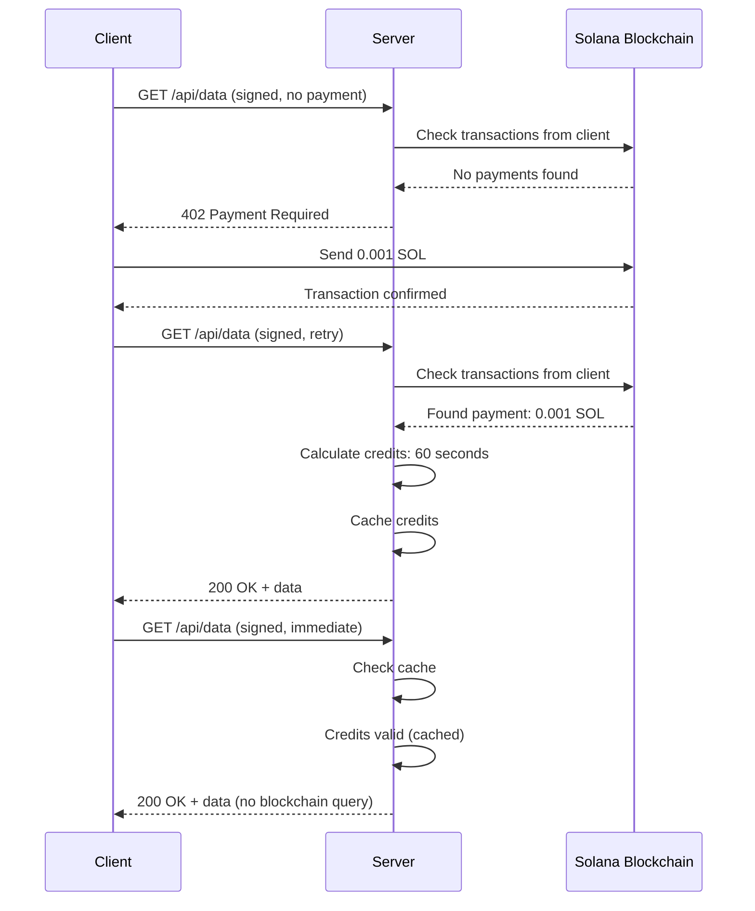

# S402 Hello Example

This example demonstrates a complete S402 implementation with:
- Express server with payment middleware
- Client with automatic payment handling
- RFC 9421 HTTP message signatures
- Real Solana devnet payments

## Features Demonstrated

✅ **Signature Verification** - Server rejects unsigned requests  
✅ **Payment Verification** - Server checks Solana transactions  
✅ **Automatic Payments** - Client sends SOL on 402 responses  
✅ **Credit Caching** - Server caches credits to minimize blockchain queries  
✅ **Subscription Model** - Time-based access (0.001 SOL per 60 seconds)

## Quick Start

### Option 1: Automated Test

```bash
./hello.sh
```

This script:
1. Starts the server in the background
2. Runs all client tests
3. Cleans up processes

### Option 2: Manual Testing

**Terminal 1 - Server:**
```bash
pnpm server
```

**Terminal 2 - Client:**
```bash
pnpm client
```

## Test Sequence

The client runs through these tests:

### 1. Health Check (No Signature Required)
```
GET /health
Expected: 200 OK
```

### 2. Protected Endpoint Without Signature
```
GET /api/data (unsigned)
Expected: 401 Unauthorized
Message: "Missing signature-input or signature headers"
```

### 3. Protected Endpoint With Signature (First Request)
```
GET /api/data (signed, no payment)
Expected: 402 Payment Required
Response includes:
  - Server public key
  - Subscription price (0.001 SOL)
  - Subscription time (60 seconds)

Client automatically:
  - Sends 0.001 SOL to server
  - Waits for confirmation
  - Retries request

Expected: 200 OK with protected data
```

### 4. Second Request (Cached Credits)
```
GET /api/data (signed, within subscription time)
Expected: 200 OK (immediate, no blockchain query)
```

### 5. Third Request (Still Valid)
```
GET /api/data (signed, within subscription time)
Expected: 200 OK
```

## Configuration

### Payment Settings

Located in `server.ts`:

```typescript
const paymentConfig = createPaymentConfig(
  SERVER_PUBLIC_KEY,
  0.001, // subscriptionPrice in SOL
  60,    // subscriptionTime in seconds
  'solana:EtWTRABZaYq6iMfeYKouRu166VU2xqa1', // devnet
  PaymentType.SOL
);
```

**Note**: First payment must be at least 0.001 SOL to cover Solana's rent-exempt minimum for new accounts (~0.00089 SOL).

### Keys

Keys are stored in `keys.ts`:

```typescript
// Client keys (has 1 SOL airdrop on devnet)
export const PRIVATE_KEY = '...';  // Hex format
export const PUBLIC_KEY = '...';   // Base58 format

// Server keys (receives payments)
export const SERVER_PRIVATE_KEY = '...';  // Hex format
export const SERVER_PUBLIC_KEY = '...';   // Base58 format
```

## Generating New Keys

```bash
npx ts-node generate-keys.ts
```

This generates:
- Client keypair (for signing and sending payments)
- Server keypair (for receiving payments)
- Key ID for signature identification

**Important**: After generating new client keys, you need to get a devnet airdrop:

```bash
solana airdrop 1 <CLIENT_PUBLIC_KEY> --url devnet
```

## How It Works

### Payment Flow



### Credit Calculation

```
timeCredits = (totalPaid / subscriptionPrice) * subscriptionTime
```

Example:
- Payment: 0.001 SOL
- Subscription: 0.001 SOL per 60 seconds
- Credits: (0.001 / 0.001) × 60 = 60 seconds

### Caching

The server caches client credits:

```typescript
{
  clientPublicKey: {
    timeRemaining: 45,  // seconds left
    expiresAt: Date,    // when credits expire
    lastTransaction: {
      signature: "...",
      amount: 0.001,
      timestamp: Date
    },
    lastChecked: Date   // when cache was updated
  }
}
```

Benefits:
- **Fast**: No blockchain query for cached credits
- **Efficient**: Reduces RPC calls to Solana
- **Accurate**: Updates on cache miss or expiry

## Viewing Transactions

After a successful payment, you can view the transaction on Solana Explorer:

```
https://explorer.solana.com/tx/<SIGNATURE>?cluster=devnet
```

The signature is printed in the client output:
```
[Payment Sender] Payment sent! Signature: onVv9GN6rHuJsrZKs3M1rcjX4Tti9MdhVp4mreXyLhqHhQpS7qZuWjjW7RAqzgiweup7yCAancpgbvdZYkXJFJ9
```

## Troubleshooting

### "Insufficient funds for rent"

This happens when trying to send less than the rent-exempt minimum to a new account. Solution: Use at least 0.001 SOL for the first payment.

### "No credits" / Always getting 402

Possible causes:
1. **Transaction not confirmed**: Wait a few seconds after payment
2. **Wrong network**: Ensure both client and server use devnet
3. **Wrong keys**: Verify client public key matches the one with SOL
4. **RPC issues**: Solana devnet can be slow, try again

### Server not starting

```bash
# Check if port 3000 is in use
lsof -i :3000

# Kill existing process
pkill -f "ts-node server.ts"
```

### Client connection refused

Ensure the server is running:
```bash
curl http://localhost:3000/health
```

## Code Structure

```
examples/hello/
├── server.ts          # Express server with s402 middleware
├── client.ts          # Client with automatic payment
├── keys.ts            # Keypairs (client + server)
├── generate-keys.ts   # Key generation script
├── hello.sh           # Automated test script
├── package.json       # Dependencies and scripts
└── README.md          # This file
```

## Expected Output

### Server Output

```
🚀 S402 Server running on http://localhost:3000
📡 Protected endpoint: http://localhost:3000/api/data (requires signature + payment)
💚 Health check: http://localhost:3000/health
🔐 Signature verification: ENABLED (RFC 9421 + ed25519)
💰 Payment verification: ENABLED (Solana devnet)
🔑 Key ID: test-key-1
🏦 Server public key: 9JX32u4tPkQiGN1KfJzsC8cGnhNxjbdKRukD9eL2J15J
👤 Client public key: J5WaEwb2LYyGbhpPju1a1MaQr1poJ8DzLQ2mALxmYEss
💵 Subscription: 0.001 SOL per 60 seconds
```

### Client Output

```
🔵 S402 Client starting...

👤 Client public key: J5WaEwb2LYyGbhpPju1a1MaQr1poJ8DzLQ2mALxmYEss

1. Testing health endpoint (no signature)...
   ✅ Health check: { status: 'ok', service: 's402-server' }

2. Testing protected endpoint WITHOUT signature (should be rejected)...
   ✅ Expected rejection: 401 Unauthorized
   Message: Missing signature-input or signature headers

3. Testing protected endpoint WITH signature (first request - will trigger payment)...
   [Payment Sender] Sending 0.001 SOL to 9JX32u4tPkQiGN1KfJzsC8cGnhNxjbdKRukD9eL2J15J
   [Payment Sender] Payment sent! Signature: onVv9GN6rHuJsrZKs3M1rcjX4Tti9MdhVp4mreXyLhqHhQpS7qZuWjjW7RAqzgiweup7yCAancpgbvdZYkXJFJ9
   ✅ Success! Received data: { message: 'Hello from s402!', ... }

4. Testing immediate second request (should use cached credits)...
   ✅ Success! Received data: { message: 'Hello from s402!', ... }
   ✅ Credits were cached - no blockchain check needed!

5. Testing third request (still within subscription time)...
   ✅ Success! Received data: { message: 'Hello from s402!', ... }

🔵 Client finished.
```

## Next Steps

1. **Explore the code**: See how middleware and fetch wrapper work
2. **Modify payment config**: Try different prices and subscription times
3. **Add endpoints**: Protect more routes with the middleware
4. **Test expiry**: Wait 60+ seconds and see credits expire
5. **Check blockchain**: View transactions on Solana Explorer

## Learn More

- [S402 Main README](../../README.md)
- [RFC 9421 Specification](https://www.rfc-editor.org/rfc/rfc9421.html)
- [Solana Web3.js Docs](https://solana-labs.github.io/solana-web3.js/)
- [x402 Documentation](https://docs.x402.org/)
